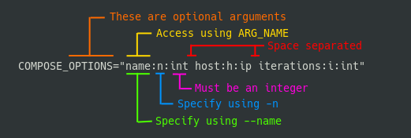

# Drivers

Drivers are resposible for executing, listing and providing help for tasks.
The driver defines the format and filename for a task file.
By default, the only driver included in Bash Task Master is the bash driver.
Built-in tasks and modules use the bash driver.

See [below](#custom-drivers) on how to implement a driver to support different file formats.

Drivers are managed by the built-in [driver](/built_in_tasks#driver) module.

!!! note
    Disabling a driver is non destructive.
    Driver files remain in place but the filename association is temporarily removed.
    This is so that if you want to re-enable a driver, it does not redownload the assets.


## Bash Driver

The bash driver is used whenever a task file is named tasks.sh or .tasks.sh.
As the name implies, it is implemented in bash and the task file is a bash script.
Arguments and tasks are defined in bash functions which are loaded by the main task function.


### Tasks

Tasks in a bash task file are created as functions with the `task_` prefix in the tasks.sh file.
Anything after `task_` is treated as the task name:

``` bash
# Example tasks.sh file

# run with task clean
task_clean() {
  ...
}

# run with task check_all
task_check_all() {
  ...
}
```

### Arguments

Each argument given to a task is loaded into the task as an `ARG_` variable.
By default, any long argument, i.e. one that starts with a `--`, is loaded with the same name as it was given on the command line.
For example, running `task hello --foo bar` would run the `task_hello` function with `ARG_FOO=bar`.

#### Specifying Arguments

Arguments can be defined in an `arguments_TASKNAME` function.
This function should be loaded alongside the task definition, i.e. inside the same tasks.sh file.
The variables inside this function are used to parse and validate the arguments before the task function is run.

The following variables are supported in arguments functions:

| Variable Name | Description | Example |
|---------------|-------------|---------|
| `SUBCOMMANDS` | a `|` delimited list of subcommands. | `SUBCOMMANDS="sign|clean|init"` |
| `[COMMAND]_DESCRIPTION` | help string for a COMMAND or SUBCOMMAND | `BUILD_DESCRIPTION="Build the project"` |
| `[COMMAND]_REQUIREMENTS` | required arguments for a COMMAND or SUBCOMMAND. | `INIT_REQUIREMENTS="out:o:str dir:d:str"` |
| `[COMMAND]_OPTIONS` | arguments for a COMMAND or SUBCOMMAND | `CLEAN_OPTIONS="f:force:bool"` |

Note that DESCRIPTION, REQUIREMENTS and OPTIONS can be used with a command AND/OR a subcommand.

REQUIREMENTS and OPTIONS are written as lists of space delimited argument specifications that are of the form: long-arg:short-arg:arg-type.

The long-arg of the argument specifies the flag to be used with `--` and also denotes the portion of the `ARG_` variable in the tasks.
The short-arg is the flag to be used with `-` (single dash).
The arg-type specifies what type the argument is. See [below](#supported-argument-types) for available types.

!!! example

    

The above specification specifies that the compose command has 3 optional arguments: `--name` or `-n`, `--host` or `-h`, `--iterations` or `-i`.
In the task we could access these values as `ARG_NAME`, `ARG_HOST` and `ARG_ITERATIONS` respectively.


!!! note
    All dashes (`-`) in subcommands and arguments are converted to underscores (`_`).
    i.e. `task thing --my-way 100` would have `ARG_MY_WAY=100`.

#### Terse task definitions (task_spec and has_arg)

For tasks without subcommands, you can avoid writing a separate `arguments_TASKNAME` function by using the **task_spec** helper.
It sets the same description and argument spec variables that the driver expects.

**task_spec** takes the task name, description, required-args string, and optional-args string (use empty string `""` for none):

``` bash
# One line replaces the arguments_example function
task_spec example "An example task" "in:i:str out:o:str" "force:f:bool"

task_example() {
  has_arg force && echo Forcing...
  echo "IN:$ARG_IN OUT:$ARG_OUT"
}
```

**has_arg** is a small helper for optional (boolean) arguments.
Use it instead of `if [[ -n "$ARG_FORCE" ]]` when you only need to run something when the flag is set:

``` bash
has_arg force && echo Forcing...
# instead of:
# if [[ -n "$ARG_FORCE" ]]; then echo Forcing...; fi
```

Both **task_spec** and **has_arg** are provided by the bash driver and are available whenever your task file is sourced.

!!! note
    Tasks that use **subcommands** (e.g. `task foo bar`) must still use the full **arguments_TASKNAME** function, where you set `SUBCOMMANDS` and per-subcommand DESCRIPTION/REQUIREMENTS/OPTIONS.

#### Alternative: full arguments_* function

When you need subcommands or prefer to define everything in one place, define an **arguments_TASKNAME** function that sets the same variables (`DESCRIPTION`, `REQUIREMENTS`, `OPTIONS`, and for subcommands `SUBCOMMANDS` plus per-subcommand variables).
The driver calls this function when present; if it is not present, it uses any variables already set (e.g. by **task_spec** when the file was sourced).

#### Arguments Example

If the following arguments are defined for the build task:

``` bash

arguments_build() {
  SUBCOMMANDS="help|frontend|backend|all"
  FRONTEND_REQUIREMENTS="out:o:str in:i:str"
  FRONTEND_OPTIONS="verbose:v:bool lint:L:bool dir:d:str"
  BACKEND_REQUIREMENTS="pid:P:int"
  BACKEND_OPTIONS="verbose:v:bool build-first:B:bool"
}

```

Then all of the following calls would succeed:

``` bash

task build frontend --out outdir --in infile
task build frontend --out outdir --in infile --lint --verbose
task build frontend -o outdir -i infile -L -v
task build all
task build backend --pid 123
task build backend -P 123
task build backend -vBP 123
task build frontend -Lo outdir -vi infile

``` 

But none of the following:

``` bash

task build frontend                              # Missing required arguments
task build frontend --in infile --lint --verbose # Unknown argument --in
task build backend -P 12 -v garbage              # Verbose is not a bool

```

#### Supported Argument Types

Available types are as follows:

|  Type         | Identifier | Description |
|  ----         | ---------- | ----------- |
|  String       | str        | A string of characters, can pretty much be anything. |
|  Integer      | int        | An integer |
|  Boolean      | bool       | An argument that is either T if present or an empty string if not* |
|  Word         | nowhite    | A string with no whitespaces |
|  Uppercase    | upper      | An uppercase string |
|  Lowercase    | lower      | A lowercase string |
|  Single Char  | single     | A single character* |

All types, except for bool, require that a value is given.
With bool arguments, the argument being present automatically sets the `ARG_VAR`.
Note that short arguments can be combined to one combined argument, e.g -vBP, but only the last can be a non bool.

!!! note
    A single character may be confused as a boolean at validation time.
    If a value for a single character argument is left out, it will be set to "1"

## Custom Drivers

Task drivers are determined by the filename of the task file.
The tasks.sh and .task.sh filenames are associated with the bash_driver.
A custom driver needs to have a unique name for it's task file.

The way that the task runner switches between drivers is by loading different sets of functions for executing, listing and providing help on tasks.

The following variables indicate what command or function to run when processing a task file.

| Variable Name | Arguments | Description |
|---------------|-----------|-------------|
| DRIVER_EXECUTE_TASK | $@ | Executes a task. Gets passed all of the arguments to the task function. |
| DRIVER_HELP_TASK | TASK_COMMAND | Shows the help for the given command. |
| DRIVER_LIST_TASKS | TASKS_FILE | Lists the available tasks in the given task file. Outputs a space or newline separated list of tasks. The list is used to verify that the task is defined. |
| DRIVER_VALIDATE_TASK_FILE | TASKS_FILE | Validates a that the given task file is readable by the driver. |

Different languages may be used to implement custom drivers but the driver must define these variables to interface with the execution environment.

The following driver file would define an alternative bash driver that doesn't do anything with arguments and just executes hello, world, foo and bar tasks:

``` bash
DRIVER_EXECUTE_TASK=execute_task
DRIVER_HELP_TASK=not_helpful
DRIVER_LIST_TASKS=acceptable_tasks
DRIVER_VALIDATE_TASK_FILE=noop

noop() {
  return 0
}

execute_task() {
  task_$1
}

not_helpful() {
  echo rtfd
}

acceptable_tasks() {
  echo "hello world foo bar"
}

```

### Installing a Custom Driver

!!! note
    This step only applies to drivers outside of repositories.
    It is handled automatically when running `task driver enable`,
    See [repositories](/repositories#repository-drivers) for more information.

After the source for a driver is added to the `$TASK_MASTER_HOME/lib/drivers/` directory, the `$TASK_MASTER_HOME/lib/drivers/installed_drivers.sh` file must be updated with the filename that should be associated with the driver.

For example, to install the pydriver driver to process task files named .tasks.py, add the following to the `installed_drivers.sh` file:

``` bash

TASK_FILE_NAME_DICT[.tasks.py]=pydriver
TASK_DRIVER_DICT[pydriver]=pydriver.sh

```

where `my_driver.sh` is the filename of the driver in the `$TASK_MASTER_HOME/lib/drivers/` directory.
