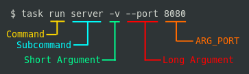

# Introduction

Bash Task Master is a utility to organize and write specialized bash scripts AKA tasks.
These tasks can either be centrally stored in a global context or stored within a project to create a shared context.

Features:

  - Centralized Management
    - Manage available tasks from anywhere in your home directory without modifying your PATH
    - Store variables that persist inside a particular context

  - Parse and Validate Input
    - Reference arguments by name ($ARG_VAR), not by number ($1)
    - Ensure that arguments match an expected format

  - Scoped Context
    - Project specific tasks are created to only be available within a project directory
    - Global tasks can be added to be available anywhere in your home directory 

  - Isolated Runtime
    - Task variables do not pollute the user session

Bash Task Master was designed to be flexible and expandable.
It is a resource to help document and store bash scripts and workflows.

Task files act as documentation for important processes.
While a simple bash script would serve the same purpose, the aim is to make it easier to co-locate project resources.
There are also quality of life aspects like argument parsing and state storage.

For example, let's say we wanted to lint, test, and run every project that we worked on.
Without bash task master, we would need to remember the command and arguments for each tool that performs each individual command.
With bash task master, it's as easy as running `task lint`, `task test`, and `task run` in a project directory.

## Installation

You do not need elevated permissions to install.
It is preferred to run bash-task-master as a non-sudo user.

1\. Install the latest version:
``` bash
curl -L https://hppr.dev/install-btm.sh | bash
```
    
2\. Log out

3\. Log back in

## Quick Start

1\. Create a new directory

``` bash

mkdir tutorial
cd tutorial

```

2\. Initialize a task file

``` bash

task init

```

3\. Write a task

``` bash

task edit # opens tasks.sh in vi by default

```
    
Add the following to the file and exit.
    
``` bash

arguments_greet() {
  GREET_DESCRIPTION="An example task!"
  GREET_REQUIREMENTS="name:n:str"
}

task_greet() {
  echo "Hello $ARG_NAME, good day to you!"
}

```

4\. Run it!

``` bash

task greet -n "internet" # Run the task
Running greet: task...
Hello internet, good day to you!

```

5\. Get help on it!

``` bash

task help greet          # Get help on the task
  Running help:greet task...
  Command: task greet
    An example task!
    Required:
      --name, -n str

```

6\. Validate it!

``` bash

task greet               # Fail the task
Missing required argument: --name

```


# Calling Tasks

Tasks are called using the `task` command.
This command takes any number of arguments.
The first argument is always interpreted as the command you would like to run.
Everything after the command depends on what type of task file you are using.

The default way that commands are parsed is with the [bash task syntax](/drivers#bash-driver).
This syntax interprets the first argument not starting with `-` after the command as an optional subcommand.
Everything after the subcommand is required to be an argument.


!!! example
    
